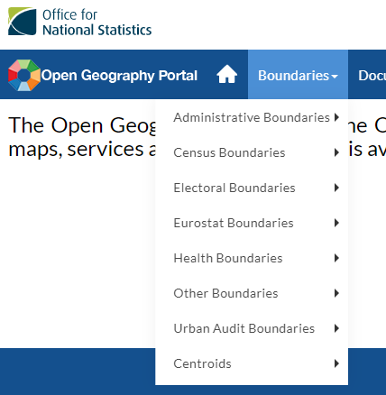

```{r setup, include=FALSE, echo=FALSE, warning =FALSE, message=FALSE}
knitr::opts_chunk$set(echo = TRUE)

#Check if the required packages are installed, if not install them
list_of_packages <- c("leaflet", "dplyr", "leaflet.extras", "geojsonio", "DT", "sp", "htmlwidgets", "htmltools")
new_packages <- list_of_packages[!(list_of_packages %in% installed.packages()[,"Package"])]
if(length(new_packages)) install.packages(new_packages)

#Load required packages
lapply(list_of_packages, library, character.only = TRUE)
```

# Chropleth maps

A choropleth map is a thematic map in which areas are shaded or patterned in proportion to the measurement of the statistical variable being displayed on the map, such as population density or per-capita income.  In this exercise we are going to produce the map below.


```{r  display_map, echo=FALSE, warning=FALSE, message=FALSE}
#Read the data from the geojson file
uk_postcode_area <- geojsonio::geojson_read("data/UK_postcode_area_generalised.geojson", what = "sp")

#Read the csv
sample_data <- read.csv("data/postcode_area_sample_data.csv")

#Join the uk_regions@data to the dataset 
uk_postcode_area@data <- uk_postcode_area@data %>%   
  left_join(sample_data, by = c("id"))

# Create a continuous palette function
pal <- colorNumeric(palette = "Blues", domain = uk_postcode_area@data$Count)

# Create the popup labels
labels <- sprintf("<strong>%s</strong><br/>%g businesses",
  uk_postcode_area$id, uk_postcode_area$Count) %>% lapply(htmltools::HTML)

#Code to add the polygons and to colour the polygons based on the value

m <- leaflet(uk_postcode_area) %>%
  addPolygons(fillColor = ~pal(Count), weight = 2, opacity = 1,   color = "white", dashArray = "3", fillOpacity = 0.7,   highlight = highlightOptions(weight = 5, color = "#666", dashArray = "", fillOpacity = 0.7, bringToFront = TRUE), label = labels, labelOptions = labelOptions(style = list("font-weight" = "normal", padding = "3px 8px"),
    textsize = "15px", direction = "auto"))

#Add a legend
m <- m %>% addLegend(pal = pal, values = ~Count, opacity = 0.7, title = NULL,
  position = "bottomright")

#Display the map
m

```

## Overview of this exercise

1. Load Boundary polygons
2. Load a dataset
3. Join the dataset to the polgyons
4. Visualise

If you want to learn more about Leaflet checkout [https://rstudio.github.io/leaflet/](https://rstudio.github.io/leaflet/).

## Load Boundary polygons

Boundaries are the shapes that make up the areas you wish to visualise.  The boudnaries could be the outline of countries, postcode areas, voting areas or any other geographical boudnary.

If your analysis is focused on the UK then the Office of National Statistics (ONS) [Open Geography Portal](http://geoportal.statistics.gov.uk/) is a fantastic resource. It has a wide range of geographies for the UK.  

The [Hierarchical Representation of UK Statistical Geographies](https://geoportal.statistics.gov.uk/datasets/hierarchical-representation-of-uk-statistical-geographies-december-2018) gives a great overview of the geographies available.

You can find the boundaries in the Boundaries menu in the portal.



For this project we are going to use the UK Postcode Areas.  The boundary files are in geojson format and can be found in the data folder of this project.

Here we load the data into a SpatialPolygonDataFrame.  Using the glimpse function on the data slot shows us there are 121 polygons, one for each of the UK postcode areas.  

```{r load_boundary}
#Read the boundaries from the geojson file
uk_postcode_area <- geojsonio::geojson_read("data/UK_postcode_area_generalised.geojson", what = "sp")

#Get glimpse of the data
glimpse(uk_postcode_area@data)

```

If we added these polygons to a map now we would see the UK Postcode Areas.

```{r visualise_boundary}
#Create a map and add the polygons
m <- leaflet(uk_postcode_area) %>%
  addPolygons()

#display the map
m
```

## Load a dataset

For this project we are going to use a sample dataset.  This dataset has given every postal area in the uk a count.  The count is a random number between 0 and 12,000.

```{r load_csv}
#Read the csv
sample_data <- read.csv("data/postcode_area_sample_data.csv")

#Show the data in a databtable
datatable(sample_data, rownames=FALSE, class = 'cell-border stripe')
```

## Join the dataset to the polgyons

We can now join the dataset onto the data frame stored in the data slot of our SpatialPolygonsDataFrame.  Both the Boundary and sample data refer to the postcode area as the id, so this is what we will join them on.

```{r join_data}
#Join the uk_regions@data to the dataset 

uk_postcode_area@data <- uk_postcode_area@data %>%   
  left_join(sample_data, by = c("id"))

#Glimpse of the data verifies that the count column has been joined to the polygon data
glimpse(uk_postcode_area@data)
```

## Visualise

Now we are ready to visualise the data by colouring each polygon based on the count value.  

We will start by creating a colour pallette using colourbrewer.

```{r create_palette}
# Create a continuous palette function
pal <- colorNumeric(palette = "Blues", domain = uk_postcode_area@data$Count)
```

Then we will create hover over labels
```{r create_labels}
# Create the popup labels
labels <- sprintf("<strong>%s</strong><br/>%g businesses",
  uk_postcode_area$id, uk_postcode_area$Count
) %>% lapply(htmltools::HTML)
```

Next we will add the polygons to the map
```{r add_polygons}
#Code to add the polygons and to colour the polygons based on the value
m <- leaflet(uk_postcode_area) %>%
  addPolygons(fillColor = ~pal(Count), weight = 2, opacity = 1,   color = "white", dashArray = "3", fillOpacity = 0.7,   highlight = highlightOptions(weight = 5, color = "#666", dashArray = "", fillOpacity = 0.7, bringToFront = TRUE), label = labels, labelOptions = labelOptions(style = list("font-weight" = "normal", padding = "3px 8px"),
    textsize = "15px", direction = "auto"))
```

Finaly we will ad a legend and display the map
```{r add_legend}
#Add a legend
m <- m %>% addLegend(pal = pal, values = ~Count, opacity = 0.7, title = NULL,
  position = "bottomright")

#Display the map
m
```

## Final Code
If we bring it all together, the code to produce the map is below.

```{r final_code, eval=FALSE}
#Check if the required packages are installed, if not install them
list_of_packages <- c("leaflet", "dplyr", "leaflet.extras", "geojsonio", "DT", "sp")
new_packages <- list_of_packages[!(list_of_packages %in% installed.packages()[,"Package"])]
if(length(new_packages)) install.packages(new_packages)

#Load required packages
lapply(list_of_packages, library, character.only = TRUE)

#Read the data from the geojson file
uk_postcode_area <- geojsonio::geojson_read("data/UK_postcode_area_generalised.geojson", what = "sp")

#Read the csv
sample_data <- read.csv("data/postcode_area_sample_data.csv")

#Join the uk_regions@data to the dataset 
uk_postcode_area@data <- uk_postcode_area@data %>%   
  left_join(sample_data, by = c("id"))

# Create a continuous palette function
pal <- colorNumeric(palette = "Blues", domain = uk_postcode_area@data$Count)

# Create the popup labels
labels <- sprintf("<strong>%s</strong><br/>%g businesses",
  uk_postcode_area$id, uk_postcode_area$Count) %>% lapply(htmltools::HTML)

#Code to add the polygons and to colour the polygons based on the value
m <- leaflet(uk_postcode_area) %>%
  addPolygons(fillColor = ~pal(Count), weight = 2, opacity = 1,   color = "white", dashArray = "3", fillOpacity = 0.7,   highlight = highlightOptions(weight = 5, color = "#666", dashArray = "", fillOpacity = 0.7, bringToFront = TRUE), label = labels, labelOptions = labelOptions(style = list("font-weight" = "normal", padding = "3px 8px"),
    textsize = "15px", direction = "auto"))

#Add a legend
m <- m %>% addLegend(pal = pal, values = ~Count, opacity = 0.7, title = NULL,
  position = "bottomright")

#Display the map
m
```

